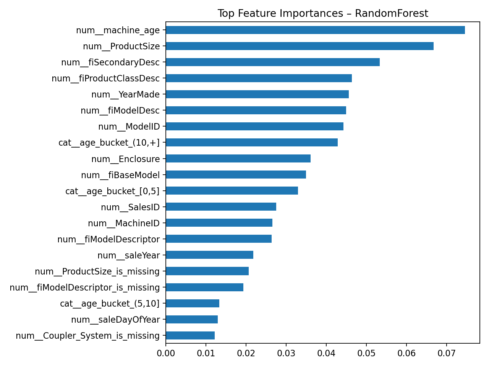
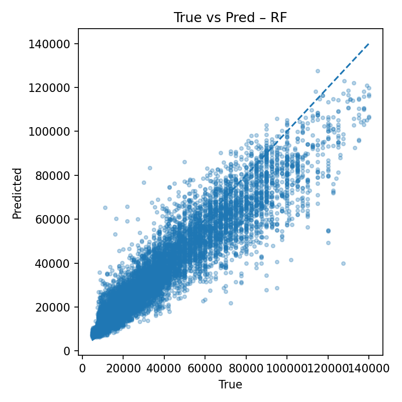

# 🚜 Bulldozer Price Prediction — Production-Ready Regression

## Project Overview
Predict the auction sale price of heavy equipment (Bulldozer) using real-world features and robust ML pipelines.  

This project goes beyond Kaggle demos, focusing on **scalable feature engineering, preprocessing, and explainability** — exactly what hiring managers want to see.

---

## 🔑 Key Enhancements
1. **Business-driven feature engineering**
   - Cleaned `YearMade`, derived `saleYear`.
   - Built **`machine_age`**, **`age_bucket`**, and **`age_x_usage`** (interaction).
2. **Robust preprocessing**
   - Unified pipeline for numeric + categorical.
   - **Rare category merging** with `min_frequency=0.01` to reduce overfitting.
3. **Model benchmarking**
   - RandomForest baseline (`200 trees`).
   - **Pipeline extensible to XGBoost** (import slot ready).
4. **Explainability**
   - Top-20 feature importances.
   - True vs Predicted scatter.
   - Residuals distribution.

---

## 📊 Results Snapshot
| Metric | Value |
|--------|-------|
| MAE | ≈6400 |
| R²  | ≈0.86 |
| Train Time | 67.6 seconds |

<p align="center">
  
  
  
</p>

---

## 🚀 How to Run
```bash
# create virtual env
python -m venv .venv && source .venv/bin/activate
pip install -r requirements.txt   # scikit-learn, pandas, matplotlib, xgboost(optional)

# launch
jupyter lab

```

## 📂 Folder Structure
```text
.
bulldozer/
├─ end-to-end-bluebook-bulldozer-price-regression.ipynb               
├─ reports/
│  └─ figures/          # feature importances, residuals
├─ requirements.txt
└─ README.md

```
